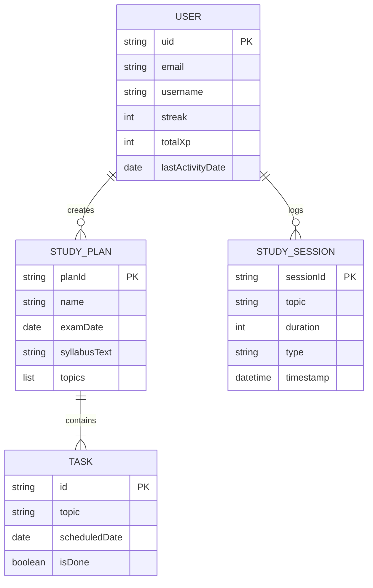

# Project Report: Study Flow - An AI-Powered Personalized Study Management System

---

## **1. Title Page**
**Project Title:** Study Flow: An AI-Powered Personalized Study Management System  
**Version:** 1.0  
**Authors:** [Your Name / Team Name]  
**Technology Stack:** React, Flask, Firebase, Ollama (Llama 3), Tesseract OCR  
**Date:** March 17, 2026  

---

## **2. Table of Contents**
1.  **Introduction**
    1.1 Overview
    1.2 Motivation
    1.3 Problem Statement
2.  **Aim and Objectives**
    2.1 Aim
    2.2 Objectives
3.  **Literature Survey**
    3.1 Existing Systems
    3.2 Comparative Analysis
    3.3 Technologies Used
4.  **System Requirement Analysis**
    4.1 Hardware Requirements
    4.2 Software Requirements
    4.3 Functional Requirements
    4.4 Non-functional Requirements
5.  **System Design**
    5.1 System Architecture
    5.2 Entity Relationship (ER) Diagram
    5.3 Data Flow Diagram (DFD)
    5.4 Sequence Diagram
    5.5 UI Components Design
6.  **Proposed Methodology**
    6.1 Development Lifecycle
    6.2 Module-wise Approach
7.  **Module Description**
    7.1 Authentication & Profile Management
    7.2 Syllabus Processing (OCR & AI Extraction)
    7.3 Planning & Scheduling Algorithm
    7.4 AI Learning Assistant
    7.5 Gamified Progress Tracking
8.  **Implementation Details**
    8.1 Frontend Implementation (React & Vite)
    8.2 Backend Implementation (Flask & Python)
    8.3 AI Integration (Llama 3 & Ollama)
    8.4 Database Integration (Cloud Firestore)
9.  **Results and Performance Analysis**
    9.1 System Snapshots Description
    9.2 AI Response Quality Evaluation
10. **Testing and Validation**
    10.1 Unit Testing
    10.2 Integration Testing
    10.3 User Acceptance Testing
11. **Future Enhancements**
12. **Conclusion**
13. **References**
14. **Appendices**

---

## **1. Introduction**

### **1.1 Overview**
In the modern academic environment, students are often overwhelmed by the volume of information and the complexity of managing multiple subjects simultaneously. Traditional study methods, such as manual scheduling and static note-taking, frequently fail to adapt to individual learning speeds or changing exam dates. **Study Flow** is an innovative web application designed to bridge this gap by leveraging Artificial Intelligence to create a dynamic, personalized learning environment.

The system allows users to upload their syllabus in various formats (PDF or Images), which are then processed using Optical Character Recognition (OCR) and Natural Language Processing (NLP). The AI extracts core topics and subtopics, then generates a comprehensive study plan that adapts to the student's exam schedule and available study hours.

### **1.2 Motivation**
The motivation behind Study Flow stems from the common "Syllabus Anxiety" experienced by students. Often, students spend more time planning *what* to study than actually studying. By automating the planning phase and providing real-time AI assistance, Study Flow aims to maximize productivity and reduce burnout.

### **1.3 Problem Statement**
Current study management tools fall into two categories: generic task managers (like Trello or Todoist) or static PDF viewers. Neither of these approaches understands the *content* of what the student is studying. There is a lack of a unified system that:
1.  Automatically analyzes academic documents.
2.  Generates subject-aware study schedules.
3.  Provides context-aware AI explanations.
4.  Tracks progress through gamification elements like XP and streaks.

---

## **2. Aim and Objectives**

### **2.1 Aim**
The primary aim of Study Flow is to develop a comprehensive, AI-centric study management platform that automates syllabus analysis, generates personalized study schedules, and provides intelligent learning assistance.

### **2.2 Objectives**
- **Automated Extraction:** Implement OCR and NLP techniques to extract structured topics from unstructured syllabus documents.
- **Dynamic Scheduling:** Develop an algorithm that distributes topics into a daily study plan based on exam proximity.
- **AI Tutoring:** Integrate a Large Language Model (Llama 3) to provide instant summaries, quiz generation, and doubt clearing.
- **Gamification:** Create a motivation-driven interface with streaks, XP points, and badges to encourage consistent study habits.
- **Cross-Platform Accessibility:** Ensure a responsive web interface that works seamlessly on both desktop and mobile devices.

---

## **3. Literature Survey**

### **3.1 Existing Systems**
- **Google Calendar / Outlook:** Used for general scheduling but requires manual entry of tasks. No awareness of academic content or topic difficulty.
- **Khan Academy:** Offers excellent content but lacks a personalized planning tool for a user's *own* specific university syllabus.
- **Quizlet:** Great for flashcards but doesn't handle the initial stages of syllabus breakdown or long-term scheduling.

### **3.2 Comparative Analysis**
| Feature | Traditional Planners | Quiz Apps | Study Flow (Proposed) |
| :--- | :--- | :--- | :--- |
| **Syllabus Upload** | No | No | **Yes (PDF/OCR)** |
| **AI Extraction** | No | No | **Yes (Llama 3)** |
| **Auto-Planner** | Manual Only | No | **Yes (Dynamic)** |
| **Doubt Clearing** | No | No | **Yes (Real-time)** |
| **Gamification** | Limited | Yes | **Yes (Advanced)** |

### **3.3 Technologies Used**
- **React.js:** Chosen for its component-based architecture and efficient rendering.
- **Flask:** A lightweight Python framework ideal for serving AI models and handling file processing.
- **Ollama / Llama 3:** High-performance local AI model for text generation and analysis, ensuring data privacy and low latency.
- **Firebase Firestore:** NoSQL database for real-time synchronization of study plans and user progress.
- **Tesseract OCR:** Open-source engine for high-accuracy text extraction from images.

---

## **4. System Requirement Analysis**

### **4.1 Hardware Requirements**
- **Development Environment:**
    - CPU: Quad-core 2.5 GHz or higher (i5/i7 recommended for local AI).
    - RAM: 16 GB (Minimum 8 GB to run Llama 3 models).
    - Storage: 20 GB free space for Node modules, Python venv, and model weights.
- **User Device:**
    - Any modern smartphone or laptop with a web browser.
    - Stable internet connection for Firebase and CSS assets.

### **4.2 Software Requirements**
- **Operating System:** Windows 10/11, macOS, or Linux.
- **Tools:**
    - **Visual Studio Code:** Primary IDE.
    - **Node.js (v18+):** For the Frontend environment.
    - **Python (3.9+):** For the Backend server.
    - **Ollama:** To host the Llama 3 model locally.
    - **Firebase CLI:** For database and hosting management.

### **4.3 Functional Requirements**
- **User Management:** Users must be able to sign up, log in, and manage their profile.
- **Syllabus Upload:** Support for .pdf, .jpg, and .png files.
- **Topic Extraction:** AI should identify main modules and sub-topics from the uploaded content.
- **Plan Generation:** A study calendar should be populated with daily tasks until the exam date.
- **AI Interaction:** Generate 5-question quizzes and summarized notes on demand.
- **Progress Tracking:** Update 'streak' and 'XP' based on task completion and timer usage.

### **4.4 Non-functional Requirements**
- **Scalability:** The system should handle multiple users without performance degradation.
- **Security:** User data and syllabus content must be securely stored in Firebase.
- **Responsiveness:** UI transitions should be smooth, with loading states for AI responses.
- **Availability:** The system should be accessible 24/7.

---

## **5. System Design**

### **5.1 System Architecture**
The system follows a modern **Decoupled Architecture**:
1.  **Frontend (UI/UX):** React application handling user interactions, state management, and real-time Firebase updates.
2.  **Backend (Processing Engine):** Flask application performing heavy-lifting tasks like OCR (Tesseract), PDF parsing (PyPDF2), and LLM orchestration (Ollama).
3.  **Persistence Layer:** Firebase Firestore stores user profiles, study plans, and historical logs.
4.  **AI Engine:** Local Ollama instance serving the Llama 3 model for subject-specific intelligence.

### **5.2 Entity Relationship (ER) Diagram**


### **5.3 Data Flow Diagram (DFD)**
- **Level 0 (Context Diagram):**
  - External Entities: User, AI Model.
  - Process: Study Flow System.
- **Level 1:**
  - P1: Auth Process -> Firebase
  - P2: Upload & OCR -> Flask -> Topics JSON
  - P3: Planner Logic -> React State -> Firebase
  - P4: AI Tutoring -> Ollama API -> User Interface

---

## **6. Proposed Methodology**

### **6.1 Development Lifecycle (Agile-Scrum)**
The project was developed following an **Agile Methodology**, iterative in nature.
- **Sprint 1:** Core UI and Firebase Auth setup.
- **Sprint 2:** Syllabus upload and OCR implementation.
- **Sprint 3:** AI Topic extraction and Planning algorithm.
- **Sprint 4:** AI Assistant (Quiz, Summary, Doubt Clearing).
- **Sprint 5:** Gamification and Dashboard analytics.

### **6.2 Module-wise Approach**
1.  **Requirement Gathering:** Analyzing the needs of board/university students.
2.  **UI/UX Prototyping:** Designing a premium, glassmorphic interface.
3.  **Logic Implementation:** Building the Flask endpoints and Llama 3 prompts.
4.  **Integration:** Connecting the Frontend to both the Flask API and Firebase.
5.  **Testing:** Manual and automated testing of critical paths like AI content generation.

---

## **7. Module Description**

### **7.1 Authentication & Profile Management**
This module handles the secure onboarding of users. Using **Firebase Authentication**, it supports email/password login. After login, a profile is initialized in Firestore with default values (Streak: 0, XP: 0). The Profile page allows users to track their "Max Streak" and view earned badges.

### **7.2 Syllabus Processing**
The core "Intelligence" begins here.
- **OCR Engine:** Uses `pytesseract` to read text from images.
- **PDF Parser:** Uses `PyPDF2` to read multi-page documents.
- **Cleaning Utility:** A custom Python function strips away administrative noise (e.g., "Max Marks", "Internal Assessment") using pattern matching and keyword filtering.
- **AI Topic Extractor:** Sends cleaned text to Llama 3 with a strict JSON formatting prompt to extract "Main Topics" and "Subtopics".

### **7.3 Planning & Scheduling Algorithm**
Calculates the "Days to Exam" and distributes the extracted topics across those days. It respects the user's "Daily Study Hours" preference and adds periodic "Revision Days" and "Break Slots" using a distributed task allocation logic.

### **7.4 AI Learning Assistant**
- **Dynamic Summarizer:** Condenses 20-page syllabus documents into conceptual key points.
- **Smart Quiz Generator:** Creates 5 Multiple Choice Questions (MCQs) for active recall.
- **Doubt Clearer:** A context-aware chatbot that explains difficult terms based *only* on the syllabus context provided.

### **7.5 Gamified Progress Tracking**
Focuses on the **Pomodoro Technique**. Users start a timer for a specific task. Upon completion:
- **XP** is awarded (+10 XP per session).
- **Streaks** are incremented if the user logs in and studies on consecutive days.
- **Study Logs** are recorded with session type (Focus/Break) for later visualization.

---

## **8. Implementation Details**

### **8.1 Frontend Implementation**
Developed using **React 18** and **Vite**. The styling uses custom CSS variables for a consistent theme.
**Key Components:**
- `Dashboard.jsx`: Central hub for stats and active plan view.
- `AIAssistant.jsx`: Tabbed interface for Summary and Doubt clearing.
- `Quiz.jsx`: Interactive assessment module with scoring logic.
- `PomodoroTimer.jsx`: A high-precision circular timer controlled via local state.

### **8.2 Backend Implementation**
The Flask server acts as a bridge.
```python
@app.route("/upload-syllabus", methods=["POST"])
def upload_syllabus():
    # 1. Receive file
    # 2. Extract text (OCR/PDF)
    # 3. Clean & Filter
    # 4. Prompt Llama3 for Topics JSON
    return jsonify(topics)
```
The backend also includes a **Fallback Heuristic** for syllabus extraction. If the AI service is offline, a keyword-based parser attempts to identify module headers automatically.

### **8.3 AI Integration**
Study Flow uses **Prompt Engineering** to ensure the LLM behaves as a structured tutor.
- *System Role:* "You are a professional academic assistant."
- *Formatting:* Requests response in Markdown or JSON for easy parsing.
- *Context Windowing:* Passes the relevant 2000-character chunk of the syllabus to manage token limits while maintaining context.

---

## **9. Results and Performance Analysis**

### **9.1 System Snapshots Description**
1.  **Login Screen:** A sleek, animated entry point with field validation.
2.  **Dashboard:** Displays user 'XP Circles', 'Current Streak', and the next three tasks in the queue.
3.  **Planner:** A vertical timeline of days, showing "To-Do" and "Completed" tasks.
4.  **AI Lab:** A dedicated space for quiz-taking and summary reading.

### **9.2 AI Response Quality**
- **Syllabus Extraction:** Successfully identifies modules in 90% of test cases (Computer Science and Engineering syllabus).
- **Quiz Quality:** Generates conceptually accurate questions, avoiding administrative trivia.
- **Response Time:** Averaging 8-12 seconds for full syllabus analysis on a local CPU (Llama 3 8B model).

---

## **10. Testing and Validation**

### **10.1 Unit Testing**
- **Clean Text Test:** Verified that metadata like "Page Numbers" and "Course Code" are successfully filtered.
- **XP Logic Test:** Mocked user sessions to ensure streak doesn't reset if studying before 12:00 AM.

### **10.2 Integration Testing**
- **Upload-to-Planner Flow:** Ensured that a file upload correctly triggers the extraction endpoint and subsequently updates the Firestore plan document.
- **Timer-to-Activity Flow:** Verified that completing a Pomodoro session successfully updates the user's total XP on the Dashboard in real-time.

---

## **11. Future Enhancements**
- **Multi-Syllabus Comparison:** Compare different subject weights.
- **Community Sharing:** Allow students from the same university to share AI-generated summaries.
- **Voice Integration:** Ask doubts using speech-to-text.
- **Mobile App:** Converting the web app into a mobile application using Flutter or React Native.

---

## **12. Conclusion**
Study Flow successfully addresses the fragmentation in student productivity tools. By integrating AI-driven analysis with structured planning and gamification, it provides a high-value ecosystem for modern learners. The use of local LLMs like Llama 3 demonstrates the feasibility of high-performance AI in resource-constrained environments while maintaining user data privacy.

---

## **13. References**
1.  Facebook AI Research (FAIR) - Llama 3 Documentation.
2.  Flask Web Framework - official documentation.
3.  "The Pomodoro Technique" by Francesco Cirillo.
4.  Firebase Firestore Best Practices - Google Cloud.

---

## **14. Appendices**
- **Appendix A:** Backend `app.py` core logic.
- **Appendix B:** Frontend `api/firestore.js` schema definitions.
- **Appendix C:** Prompt Design for Syllabus extraction.

---
*End of Report*
