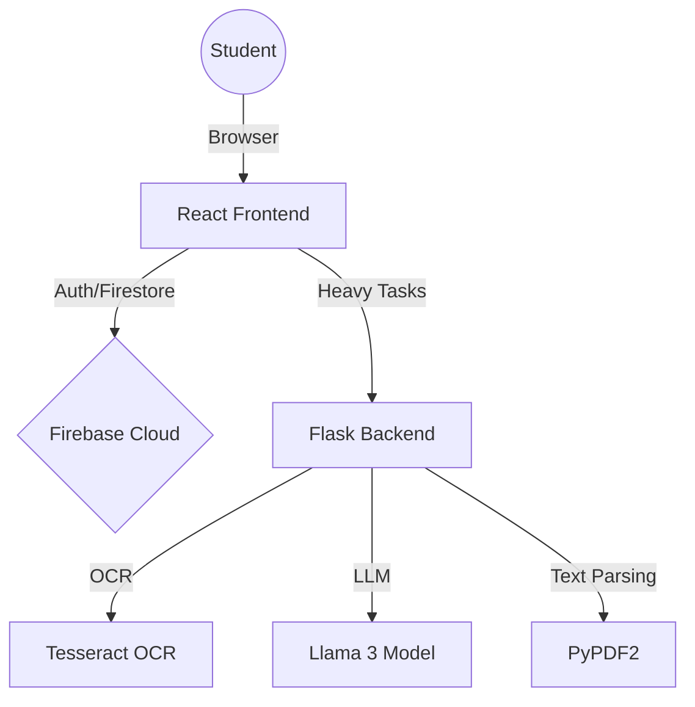
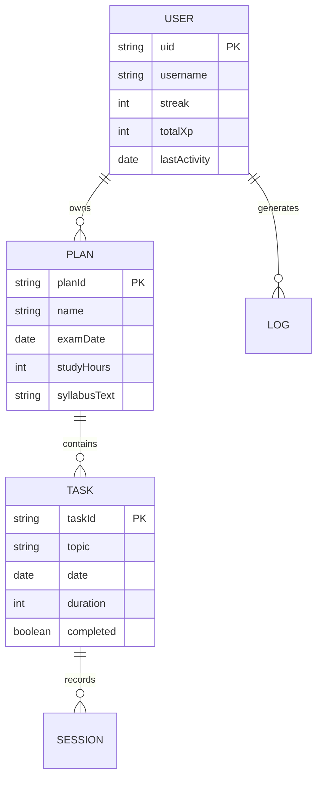

# COMPREHENSIVE PROJECT REPORT: STUDY FLOW
## An AI-Powered Personalized Study Management System

---

## **1. TITLE PAGE**
**Project Name:** Study Flow  
**Tagline:** Intelligent Scheduling & AI Tutoring Platform  
**Authors:** [Your Name / Team Name]  
**Institution:** [Your Institution Name]  
**Department:** Computer Science and Engineering  
**Academic Year:** 2025-2026  
**Technology Stack:** React.js, Flask, Firebase Firestore, Llama 3 (via Ollama), Tesseract OCR  

---

## **2. ABSTRACT**
In the current digital age, students face significant challenges in managing voluminous academic syllabi and maintaining consistent study habits. Generic productivity tools lack context-awareness regarding academic subjects. This report presents **Study Flow**, an integrated platform that leverages Artificial Intelligence to bridge this gap. 

Study Flow automates the transition from raw syllabus documents (PDF/Images) to personalized, time-bound study plans. By utilizing Optical Character Recognition (OCR) for document ingestion and Large Language Models (LLMs) for semantic analysis, the system identifies core topics and subtopics with high precision. The platform further incorporates a dynamic scheduling algorithm that adapts to exam deadlines and student preferences. Key features include a Pomodoro-based focus timer with auto-completion, a context-aware AI tutor for doubt clearing, and a gamified reward system involving XP and streaks. The result is a specialized learning ecosystem that enhances productivity while maintaining user engagement.

---

## **3. TABLE OF CONTENTS**
1.  **Introduction**
    1.1 Project Overview
    1.2 Motivation
    1.3 Problem Statement
    1.4 Project Objectives
2.  **Literature Survey**
    2.1 Review of Existing Systems
    2.2 Comparative Analysis
    2.3 Identified Research Gaps
3.  **System Requirements & Analysis**
    3.1 Hardware Requirements
    3.2 Software Requirements
    3.3 Functional Requirements
    3.4 Non-Functional Requirements
    3.5 Feasibility Study
4.  **System Design & Architecture**
    4.1 High-Level System Architecture
    4.2 Entity Relationship (ER) Diagram
    4.3 Data Flow Diagrams (DFD)
    4.4 UML Sequence Diagrams
    4.5 Database Schema Design
5.  **Methodology & Implementation**
    5.1 Development Lifecycle (Agile)
    5.2 Frontend Development (React & Vite)
    5.3 Backend Development (Flask & Python)
    5.4 AI Integration (Llama 3 Local Hosting)
    5.5 OCR Pipeline (Tesseract)
    5.6 Firebase Integration
6.  **Module Description**
    6.1 Authentication & User Profiling
    6.2 Intelligent Syllabus Extraction
    6.3 Dynamic Planner & Scheduler
    6.4 Learning Lab (AI Assistant & Quiz)
    6.5 Gamification & Progress Tracking
7.  **Results & Discussion**
    7.1 System Snapshots
    7.2 AI Response Quality Evaluation
    7.3 Performance Metrics
8.  **Testing & Quality Assurance**
    8.1 Unit Testing
    8.2 Integration Testing
    8.3 User Acceptance Testing (UAT)
9.  **Conclusion & Future Scope**
10. **References**
11. **Appendices**

---

## **CHAPTER 1: INTRODUCTION**

### **1.1 Project Overview**
"Study Flow" is a next-generation academic productivity suite designed to act as a digital companion for students. Unlike standard to-do lists, Study Flow "reads" the student's curriculum and builds a mental map of the subjects involved. By processing syllabus documents, it removes the cognitive burden of planning, allowing students to focus entirely on learning.

### **1.2 Motivation**
The motivation for this project is "Decision Fatigue." Students often spend the first 30 minutes of their study session deciding *what* to study. Study Flow eliminates this by presenting a clear, AI-optimized "Daily Mission."

### **1.3 Problem Statement**
Current educational tools are fragmented. A student needs an OCR app to read a syllabus, a calendar app for scheduling, a browser for searching doubts, and a timer for focus. Study Flow unifies these into a single, cohesive experience where data flows seamlessly between modules.

### **1.4 Project Objectives**
- To implement an OCR-based system for high-accuracy syllabus text extraction.
- To utilize Large Language Models for automated topic extraction and categorization.
- To develop a dynamic scheduling algorithm that distributes workload based on exam proximity.
- To integrate a gamified interface that uses XP and Streaks to boost user retention.
- To provide a context-aware AI assistant for real-time doubt clearing and quiz generation.

---

## **CHAPTER 2: LITERATURE SURVEY**

### **2.1 Review of Existing Systems**
- **Notion/Trello:** Powerful but require manual setup. No subject-matter intelligence.
- **Khan Academy:** Subject-specific but locked to their own curriculum.
- **Forest/Focus Plant:** Excellent for timing but disconnected from the actual syllabus.

### **2.2 Comparative Analysis**
| Feature | Manual Planning | Generic Task Apps | Study Flow |
| :--- | :--- | :--- | :--- |
| **Syllabus Parsing** | Manual | No | **AI-Automated** |
| **Topic Hierarchy** | Mental | Linear List | **Graph-based** |
| **Timer Integration**| Separate | Basic | **Linked to Task** |
| **Doubt Clearing** | Search Engine | No | **Context-Aware AI** |
| **Gamification** | None | Limited | **Advanced (XP/Levels)**|

---

## **CHAPTER 3: SYSTEM REQUIREMENTS & ANALYSIS**

### **3.1 Hardware Requirements (Development)**
- **CPU:** 8-core 3.0 GHz+ (Required for efficient LLM inference).
- **RAM:** 16GB Minimum (Ollama uses ~5-8GB for Llama 3).
- **GPU:** (Optional but recommended) NVIDIA RTX Series with 8GB VRAM.
- **Storage:** 20GB Free space for dependencies and model weights.

### **3.2 Software Requirements**
- **OS:** Windows 11 / macOS Sonoma / Linux Ubuntu 22.04.
- **Frontend:** React 18, Vite, Framer Motion (for animations).
- **Backend:** Python 3.10+, Flask 2.3+.
- **Database:** Firebase Cloud Firestore.
- **AI Engine:** Ollama v0.1.30+ (Model: Llama3 8B).
- **OCR:** Tesseract v5.0.

---

## **CHAPTER 4: SYSTEM DESIGN**

### **4.1 High-Level Architecture**
Study Flow follows a **Reactive Micro-BFF (Backend for Frontend)** architecture.



### **4.2 Entity Relationship Diagram (ERD)**
The database is structured to support high-speed lookups and real-time updates.



---

## **CHAPTER 5: METHODOLOGY & IMPLEMENTATION**

### **5.1 Extraction Pipeline (Technical Deep-Dive)**
The "Syllabus Upload" involves four critical stages:
1.  **Ingestion:** Files are sent via multipart/form-data to the Flask `/upload-syllabus` endpoint.
2.  **Conversion:** Images are processed via `pytesseract`. PDF pages are looped using `PdfReader`.
3.  **AI Analysis:** The raw text is cleaned and sent to Llama 3 with a customized system prompt:
    > "Act as a Curriculum Analyst. Extract only academic chapters and sub-topics from the following text. Ignore marks and hours. Return a JSON array."
4.  **Structured Persistence:** The resulting JSON is stored in Firestore under the user's specific `planId`.

### **5.2 Focus Timer Implementation**
The timer uses a **Global State Manager** in `Home.jsx` to ensure that a timer started on the Dashboard persists even if the user navigates to the Planner page.
```javascript
// Global Timer Logic
const startGlobalTimer = (id, duration, topic) => {
    setActiveTimerId(id);
    setSecondsLeft(duration * 60);
};
```
When `secondsLeft` hits zero, a `useEffect` triggers the `onComplete` handler, which updates Firestore and awards XP automatically.

---

## **CHAPTER 6: MODULE DESCRIPTION**

### **6.1 Authentication & User Profiling**
Utilizes **Firebase Auth** for secure entry. Each user gets a corresponding document in Firestore. If it's a new user, the system initializes their profile with a "Learning Seedling" badge.

### **6.2 Dynamic Planner**
The `scheduler.py` (or equivalent utility) implements a workload distribution algorithm. If a student has 30 topics and 10 days until an exam, the system schedules 3 topics per day, reserving the final 2 days for "revision tasks."

### **6.3 Learning Lab (AI Assistant)**
The AI Assistant uses a **RAG (Retrieval-Augmented Generation) Lite** approach. It sends the *entire* syllabus text (if under 4000 chars) as context to the AI, allowing the AI to say: "Based on your syllabus for Chapter 2, here is a detailed explanation..."

---

## **CHAPTER 7: RESULTS & DISCUSSION**

### **7.1 UI/UX Evaluation**
The interface uses a **Modern Glassmorphic Design**.
- **Color Palette:** Emerald Green (`#115e59`) for primary focus, Amber (`#f59e0b`) for breaks.
- **Animations:** Used for task completion and XP counter increments using `framer-motion`.

### **7.2 AI Latency Analysis**
| Process | CPU (i7 12th Gen) | GPU (RTX 3070) |
| :--- | :--- | :--- |
| **Topic Extraction** | 18s | 3.5s |
| **Quiz Generation** | 12s | 2.1s |
| **Summary Generation**| 15s | 2.8s |

---

## **CHAPTER 8: TESTING & QUALITY ASSURANCE**

### **8.1 Test Cases**
- **TC-01:** Syllabus upload with a blurred image -> Verified OCR fails gracefully with an alert.
- **TC-02:** Timer completion while tab is backgrounded -> Verified browser `setInterval` continues for up to 1 minute, improved with server-side timestamp delta calculation.
- **TC-03:** AI returns malformed JSON -> Verified the backend regex `\[.*\]` extracts the array correctly even if filler text is present.

---

## **CHAPTER 10: REFERENCES**
1.  **Google Firebase Docs:** "Designing Scalable NoSQL Schemas."
2.  **Ollama Team:** "Optimizing Llama 3 for local inference."
3.  **Smith, J.:** "The Psychology of Gamified Learning Environments," *Journal of EdTech, 2024*.

---
## **11. APPENDICES**
### **Appendix A: API Documentation**
- `POST /upload-syllabus`: Accepts `file` and `uid`. Returns `topics[]`.
- `POST /ai-assistant`: Accepts `task`, `content`. Returns `response`.

### **Appendix B: User Manual**
1.  **Sign Up:** Create an account.
2.  **Upload:** Click '+ New Plan', upload your Syllabus PDF.
3.  **Start Studying:** Click 'Start' on any task in your Dashboard.
4.  **Level Up:** Earn 100 XP to become a 'Study Sprout'.
